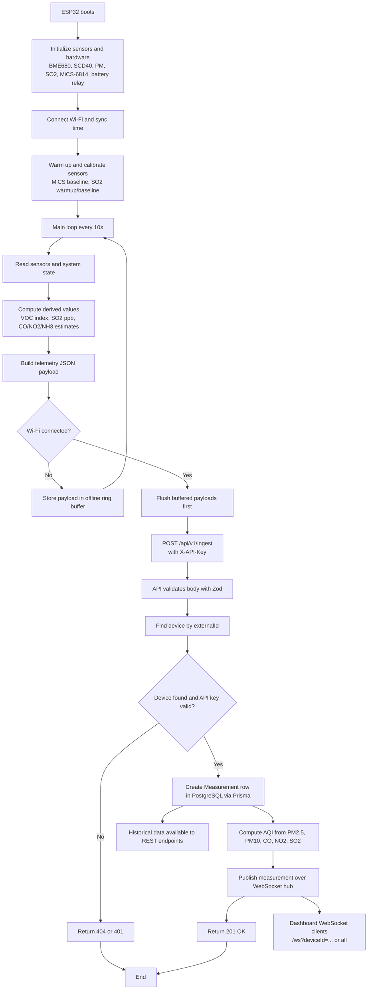
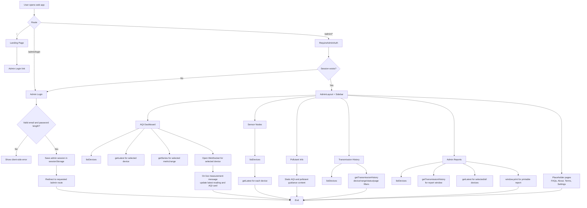
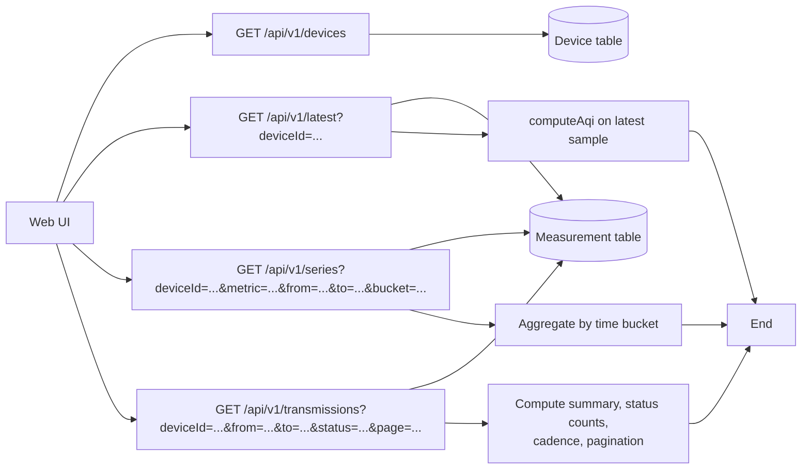

# App Flowchart

This document captures the current end-to-end flow of the air quality app based on the code in `firmware/`, `api/`, and `web/`.

## 1. End-to-End System Flow

## 2. Web App Navigation and Data Flow

## 3. Backend Read Endpoints Used by the Web App

